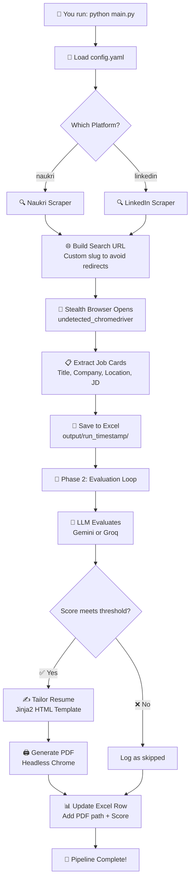
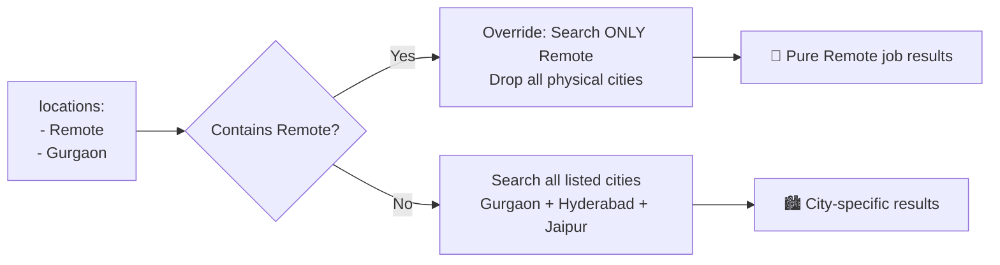

<div align="center">

# 🤖 Stealth Job Application Pipeline

**A fully automated, AI-powered job hunting tool that scrapes jobs, evaluates them against your resume, and generates custom tailored resumes — all with a single command.**

<br/>

[](https://www.python.org/)
[](https://selenium.dev)
[](https://ai.google.dev/)
[](LICENSE)

<br/>

> 🎯 **The Goal**: Stop spending hours manually applying to jobs. Let AI do the boring work — you focus on the interviews.

</div>

---

## 📖 Table of Contents

- [What Does It Do?](#-what-does-it-actually-do)
- [Key Features](#-key-features)
- [System Architecture](#-system-architecture)
- [Project Structure](#-project-structure)
- [Prerequisites](#-prerequisites)
- [Installation](#-installation)
- [Configuration Guide](#-configuration-guide)
- [How to Run](#-how-to-run)
- [Output Explained](#-output-explained)
- [Current Status](#-current-status)
- [Upcoming Features](#-upcoming-features)

---

## 🤔 What Does It Actually Do?

Imagine waking up every morning and finding a folder with:
- 📊 A spreadsheet listing every relevant job posted in the last 24 hours
- 📄 A professionally tailored, one-page PDF resume for each qualifying job
- 🧠 AI-generated notes on what skills you're missing for each role

**That's exactly what this tool delivers — automatically.**

It works in two phases:

```
Phase 1: SCRAPE    →   Opens a browser, searches your dream jobs, saves all the details
Phase 2: EVALUATE  →   AI reads each job, scores it against your resume, tailors a PDF
```

---

## ✨ Key Features

| Feature | Description |
|---------|-------------|
| 🕵️ **Stealth Scraping** | Uses `undetected_chromedriver` to bypass bot detection on LinkedIn & Naukri |
| ⚙️ **Config-Driven** | Everything controlled from one `config.yaml` — no complex CLI needed |
| 🔄 **Multi-Search** | Search multiple job titles × multiple cities in a single run |
| 🕒 **Freshness Filter** | Toggle to only see jobs posted in the last 24 hours |
| 🧠 **AI Scoring** | Gemini or Groq critically evaluates your resume-to-JD match |
| 📄 **Resume Tailoring** | Auto-generates a custom 1-page PDF resume for every qualifying job |
| 📊 **Excel Tracking** | All results logged in a clean Excel file with links to each PDF |
| ✨ **Auto-Cleanup** | Empty output folders from failed runs are automatically deleted |

---

## 🏗️ System Architecture

Here's how data flows through the entire pipeline:



### 🌍 Smart Location Conflict Resolver

The orchestrator prevents you from accidentally narrowing your search when mixing "Remote" with city names:



---

## 📁 Project Structure

```
job_auto/
│
├── 📄 main.py                  ← Entry point — orchestrates all phases
├── ⚙️ config.yaml              ← YOUR control panel — edit this to customize
├── 🔑 .env                     ← API keys (never commit this!)
├── 📋 resume.pdf               ← Your base resume
├── 📦 requirements.txt         ← Python dependencies
│
├── modules/
│   ├── 🕷️ scraper.py           ← Platform router (naukri vs linkedin)
│   ├── 🧠 evaluation.py        ← AI job matching & scoring logic
│   ├── ✍️ resume_tailor.py     ← Resume tailoring + Chrome PDF generation
│   ├── 💾 data_manager.py      ← Excel read/write operations
│   ├── 🌐 browser.py           ← Chrome driver lifecycle management
│   ├── 🤖 llm.py               ← LLM provider interface (Gemini & Groq)
│   └── scrapers/
│       ├── naukri.py           ← Naukri-specific stealth scraping
│       └── linkedin.py         ← LinkedIn-specific stealth scraping
│
├── templates/
│   └── 🎨 resume.html          ← Beautiful HTML/CSS resume template (Jinja2)
│
└── output/
    └── run_20260322_202401/    ← Auto-created per run (timestamped)
        ├── 📊 job_applications.xlsx
        ├── 📄 Tailored_Resume_Company1.pdf
        └── 📄 Tailored_Resume_Company2.pdf
```

---

## ✅ Prerequisites

Before installing, make sure you have:

- **Python 3.9+** — [Download here](https://www.python.org/downloads/)
- **Google Chrome** — [Download here](https://www.google.com/chrome/) (any recent version)
- **An LLM API Key** — Get one free from:
  - [Google AI Studio](https://aistudio.google.com/) (for Gemini)
  - [Groq Console](https://console.groq.com/) (for Groq — very fast & free tier available!)

---

## 📦 Installation

**Step 1 — Clone the repository**
```bash
git clone https://github.com/Kartik-Lohar/Job_Automation.git
cd Job_Automation
```

**Step 2 — Install dependencies**
```bash
pip install -r requirements.txt
```

**Step 3 — Create your `.env` file**

Create a file named `.env` in the project root:
```env
GEMINI_API_KEY=paste_your_gemini_key_here
GROQ_API_KEY=paste_your_groq_key_here
```
> ⚠️ **Important**: Never share or commit your `.env` file. It's already listed in `.gitignore` for your safety.

**Step 4 — Add your resume**

Drop your resume into the project root and name it `resume.pdf`. That's it!

---

## ⚙️ Configuration Guide

All settings live in `config.yaml`. Here's every field explained:

```yaml
# ============================================================
# 1. SEARCH SETTINGS
# ============================================================
search:
  platform: "naukri"           # "naukri" or "linkedin"

  titles:                      # Job titles to search (add as many as you want!)
    - "Machine Learning Engineer"
    - "Data Scientist"

  locations:                   # Cities to search in
    - "Gurugram"
    - "Hyderabad"
    - "Jaipur"
    # ⚠️  IMPORTANT: If you add "Remote" here, it will OVERRIDE all cities
    #     and perform a pure Remote search. Remove "Remote" to search cities.

  max_jobs: 5                  # How many jobs to scrape per run
  past_24_hours: true          # true = last 24h only  |  false = all time
  headless: false              # false = see browser    |  true = run silently

# ============================================================
# 2. EVALUATION & OUTPUT SETTINGS
# ============================================================
evaluation:
  llm_provider: "groq"         # "gemini" or "groq"
  threshold: 50                # Min score (0–100) to generate a tailored resume

  base_resume_path: ""         # Leave empty to auto-detect resume.pdf in root
                               # Or specify: "C:/Users/you/Documents/Resume.pdf"

  output_path: ""              # Leave empty → saves to output/ in project root
                               # Or specify: "D:/My_Job_Search/Results/"

# ============================================================
# 3. YOUR PROFILE (injected into every tailored resume)
# ============================================================
profile:
  linkedin: "https://www.linkedin.com/in/your-profile"
  github: "https://github.com/your-username"
  portfolio: "https://your-portfolio.com"
```

---

## ▶️ How to Run

Once configured, run with a single command:

```bash
python main.py
```

You'll see real-time progress in your terminal:

```
📄  Resume loaded from: C:\Users\...\resume.pdf  (3327 chars)

════════════════════════════════════════════════
  PHASE 1 — SCRAPING
════════════════════════════════════════════════
  Platform : naukri
  Title    : Machine Learning Engineer, Data Scientist
  Location : Gurugram, Hyderabad, Jaipur
  Max jobs : 5
  Headless : False

  ✅ Job 1: ML Engineer @ Google — Score: 85 — Tailoring resume...
  ✅ Job 2: Data Scientist @ Amazon — Score: 72 — Tailoring resume...
  ❌ Job 3: Data Consultant @ Deloitte — Score: 40 — Below threshold, skipping.

════════════════════════════════════════════════
  ✅  PIPELINE COMPLETE
════════════════════════════════════════════════
  Jobs evaluated  : 5/5
  Resumes created : 3
  Excel updated   : output/run_20260322_202401/job_applications.xlsx
════════════════════════════════════════════════
```

---

## 📂 Output Explained

Every run creates a clean, isolated timestamped folder inside `output/`:

```
output/
└── run_20260322_202401/
    ├── job_applications.xlsx     ← Summary of ALL scraped jobs
    ├── Resume_ML_Google.pdf      ← Tailored resume for Job 1
    └── Resume_DS_Amazon.pdf      ← Tailored resume for Job 2
```

**Inside the Excel file:**

| Column | What it contains |
|--------|-----------------|
| Job Title | Role name scraped from the posting |
| Company | Company name |
| Location | City / Remote |
| Match Score | AI score 0–100 (how well your resume fits) |
| Missing Skills | Skills in the JD that you don't have yet |
| Readiness Assessment | AI's honest written evaluation |
| Resume PDF Path | Path to the custom tailored PDF |

---

## 📌 Current Status

| Feature / Bug | Status |
|---------------|--------|
| Naukri multi-title URL redirect fix | ✅ Fixed |
| Remote vs City search collision | ✅ Fixed |
| LLM always returning same score (92) | ✅ Fixed |
| Empty output folder auto-cleanup | ✅ Implemented |
| Configurable 24-hour freshness filter | ✅ Implemented |
| Multi-title / Multi-location search | ✅ Implemented |
| Deterministic profile link injection | ✅ Implemented |
| Config-driven architecture (no CLI args) | ✅ Implemented |
| CSS 1-page PDF constraint refinement | 🔄 In Progress |
| LinkedIn platform full validation | 🔄 In Progress |

---

## 🚀 Upcoming Features

- [ ] 🌐 Add **Glassdoor** and **Indeed** scraper support
- [ ] 📊 Build a **lightweight web dashboard** to browse results in-browser
- [ ] 📧 **Auto-apply** feature using generated tailored resumes
- [ ] 📩 **Email digest** — daily summary of top job matches sent to your inbox

---

## 🤝 Contributing

Contributions, bug reports, and feature suggestions are welcome!

1. Fork the repository
2. Create your feature branch (`git checkout -b feature/YourFeature`)
3. Commit your changes (`git commit -m 'Add YourFeature'`)
4. Push to the branch (`git push origin feature/YourFeature`)
5. Open a Pull Request

---

## 📄 License

This project is licensed under the [MIT License](LICENSE).

---

<div align="center">
  <br/>
  <strong>Made with ❤️ to automate the boring parts of job hunting.</strong>
  <br/><br/>
  <em>Happy Job Hunting! 🎯 Automate the boring stuff — focus on the interviews.</em>
  <br/><br/>
  ⭐ If this project helped you, please consider giving it a star on GitHub!
</div>
