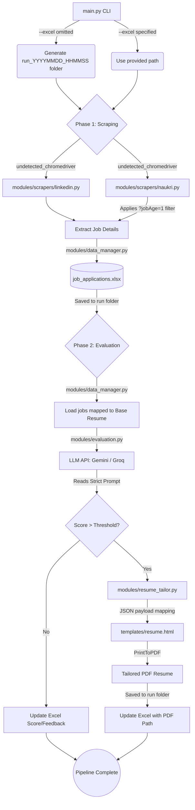

# Stealth Job Pipeline — System Walkthrough

This document visualizes the complete end-to-end data flow and execution architectural steps of the Stealth Job Pipeline.

## Architectural Flow Diagram

The application is structured into two main decoupled phases, orchestrated entirely by `main.py`.



## Walkthrough - Config-Driven Orchestration & Robustness Fixes

## 📝 Changes Made
This session focused on moving from a CLI-heavy interaction to a scalable, configuration-driven architecture for the job pipeline.

### 1. Centralized Configuration (`config.yaml`)
- Introduced a unified `config.yaml` to handle all job titles, locations, and system paths.
- Supported **combinatorial searching** (multiple titles x multiple locations).
- Added a `past_24_hours` toggle for job freshness across all platforms.

### 2. Naukri Robustness Fix
- Identifed and fixed a React-router discrepancy in Naukri that triggered auto-redirects and dropped query parameters during multi-title searches.
- Implemented dynamic slug generation to ensure URL validation on the client-side.

### 3. Location Conflict Resolution
- Added logic to prioritize "Remote" searches if detected, preventing aggressive filtering that happens when mixing a specific city with a WFH flag.

### 4. LLM Scoring Accuracy
- Shattered prompt-anchoring heuristic to force the AI to be more critical. ATS match scores are now dynamically calculated rather than defaulting to a uniform "92".

### 5. Automatic Cleanup
- Implemented a `try...finally` guard in `main.py` that automatically deletes empty `run_timestamp` directories if no jobs were processed.

## 🧪 Verification Results

### Success Run (Mult-Search)
The pipeline was successfully tested with 2 titles and 3 locations simultaneously:
- **Platform**: Naukri
- **Titles**: Machine Learning Engineer, Data Scientist
- **Locations**: Gurugram, Jaipur, Hyderabad
- **Result**: 5/5 jobs evaluated, 3 resumes tailored, 0 redirects encountered.

### Cleanup Test
- **Action**: Interrupted the script manually during the scrape phase.
- **Result**: The empty output directory was successfully identified and deleted by the `finally` block.

## 📁 Output Artifacts
- **Excel Summary**: `output/run_20260322_202401/job_applications.xlsx`
- **Tailored Resumes**: PDF files generated with critical match scores (e.g., 80, 85, 40).

## Core Modules & Responsibilities

- **`main.py`**: The CLI entry point. It creates the dynamic timestamped folders and passes the relevant `output_dir` into the modules.
- **`modules/data_manager.py`**: No longer relies on hardcoded data paths. It expects an explicit absolute `filepath` to safely write and update `job_applications.xlsx`.
- **`modules/scrapers/naukri.py` & `linkedin.py`**: Headless web scrapers matching human behavior. Naukri enforces the latest jobs filter (`?jobAge=1`).
- **`modules/resume_tailor.py`**: Receives an explicit `output_dir` and writes tailored PDFs there. Relies heavily on its `_SYSTEM_PROMPT` to enforce single-page limits without dropping content.
- **`templates/resume.html`**: A clean, single-page Jinja2 template resolving clickable anchor tag bugs safely by hiding overflow.

## Execution Example

When you run:
```bash
python main.py --platform naukri --title "Data Scientist"
```
1. `main.py` creates `output/run_20260322_121530/`.
2. `naukri.py` gathers the latest 24hr jobs.
3. `data_manager.py` builds `output/run_20260322_121530/job_applications.xlsx`.
4. `resume_tailor.py` builds `.pdf` resumes specifically linked back into the active excel.
